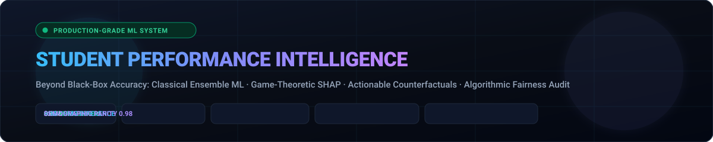
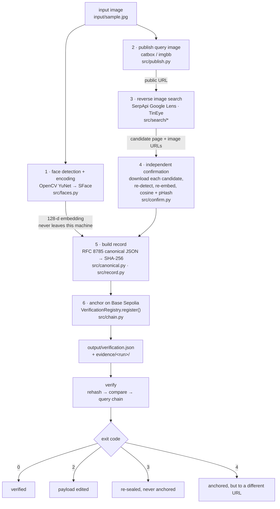

<!-- ═══════════════════════════════════════════════════════════════════════════ -->
<!-- ANIMATED HEADER BANNER                                                    -->
<!-- ═══════════════════════════════════════════════════════════════════════════ -->

<div align="center">

<a href="https://github.com/satyamshrivastav955-dotcom/face-blockchain-verification">
  
</a>

<br/>
<br/>

<!-- ─── SHIELD BADGES ─────────────────────────────────────────────────── -->

[](https://python.org)
[](https://opencv.org)
[](https://soliditylang.org)
[](https://base.org)
[](LICENSE)

<br/>

<!-- ─── SECONDARY BADGES ──────────────────────────────────────────────── -->


<br/>
<br/>

<!-- ─── ONE-LINE DESCRIPTION ──────────────────────────────────────────── -->

<samp>

**Detect a face → Reverse-image search → Independently verify → Anchor proof on-chain**

</samp>

<br/>

---

</div>

<!-- ═══════════════════════════════════════════════════════════════════════════ -->
<!-- PROJECT DESCRIPTION                                                       -->
<!-- ═══════════════════════════════════════════════════════════════════════════ -->

<table>
<tr>
<td>

Take a photo of a face, find the real social-media post that photo came from using a live
reverse-image search, prove the match locally with a face recogniser, then anchor the result on a
public blockchain so the record cannot be quietly rewritten afterwards.

The search result is never trusted on its own. Every candidate the provider returns is downloaded,
re-detected, re-embedded and scored on this machine, and the scores for the rejected candidates are
kept in the record alongside the winner. That score table is the point: it is what distinguishes a
real match from a hardcoded one, and it is what a reviewer should look at first.

> **What this tool claims, precisely:** *the image at `matched_image_url`, published at `matched_url`,
> contains the same face as the input image.* That is a statement about **image provenance**, not
> about the identity of a person. It says where a picture appears on the internet. It does not say who
> anybody is, and it should not be used as though it did. See [Limitations](#limitations).

</td>
</tr>
</table>

---

<!-- ─── TABLE OF CONTENTS ─────────────────────────────────────────────── -->

<details open>
<summary><h2>📑 Table of Contents</h2></summary>

&nbsp;&nbsp;🏗️ [Architecture](#architecture)
&nbsp;&nbsp;✨ [Features](#features)
&nbsp;&nbsp;📋 [Requirements](#requirements)
&nbsp;&nbsp;⚙️ [Installation](#installation)
&nbsp;&nbsp;🔐 [Environment Variables](#environment-variables)
&nbsp;&nbsp;🚀 [How to Run](#how-to-run)
&nbsp;&nbsp;📜 [Smart Contract](#smart-contract)
&nbsp;&nbsp;📊 [Example Output](#example-output)
&nbsp;&nbsp;📦 [The Record & Evidence Bundle](#the-record-and-the-evidence-bundle)
&nbsp;&nbsp;🧪 [Tests](#tests)
&nbsp;&nbsp;⚠️ [Limitations](#limitations)
&nbsp;&nbsp;🔒 [Security & Privacy](#security-and-privacy)
&nbsp;&nbsp;🎬 [Demo Video](#demo-video)

</details>

---

## Architecture



<details>
<summary>Same diagram as plain text</summary>

```
   input image
        |
        +---------------------------+
        |                           |
        v                           v
 [1] detect + encode         [2] publish to a public URL
     YuNet -> SFace              (Google Lens needs a fetchable URL)
        |                           |
        |  128-d embedding           v
        |  stays local        [3] reverse image search
        |                        SerpApi Lens | TinEye
        |                           |
        |                     candidate page + image URLs
        |                           v
        +------------------> [4] independent confirmation
                                 for each candidate: download,
                                 re-detect, re-embed,
                                 cosine >= 0.363 OR pHash <= 12
                                     |
                                     v
                             [5] canonicalize (RFC 8785) + SHA-256
                                     |
                                     v
                             [6] anchor on Base Sepolia
                                     |
                                     v
                        output/verification.json + evidence/<run>/
                                     |
                                     v
                                  verify
                       rehash -> compare -> query the chain
                    0 ok | 2 edited | 3 not anchored | 4 wrong URL
```
</details>

### Module map

| File | Responsibility |
| --- | --- |
| `src/main.py` | CLI: `doctor`, `search`, `deploy`, `register`, `verify`, `tamper-demo`. Argument wiring and exit codes. |
| `src/pipeline.py` | Orchestrates register and verify. The only place the step order lives. |
| `src/faces.py` | YuNet detection, SFace embedding, cosine similarity. Plus a clearly-labelled stub engine for offline tests. |
| `src/search/base.py` | The provider interface — `search(image_path, *, image_url, max_results) -> SearchResult` — plus `Candidate`, domain ranking, and the `needs_public_url` / `is_offline_stub` capability flags. |
| `src/search/__init__.py` | `build_provider(name, settings)` — the provider registry and its aliases. |
| `src/search/serpapi_lens.py` | SerpApi's Google Lens engine. |
| `src/search/tineye.py` | TinEye's commercial API. |
| `src/search/local_fixture.py` | Reads candidates from a local JSON file. **Development only** — refuses to run without `--allow-offline-stub`. |
| `src/publish.py` | Uploads the query image so Lens can fetch it (`catbox`, `imgbb`, or bring your own URL). |
| `src/confirm.py` | The anti-hardcoding core: independently re-verifies every candidate and keeps the rejections. |
| `src/imaging.py` | Image IO, DCT perceptual hash, defensive downloads, the side-by-side comparison render. |
| `src/canonical.py` | RFC 8785 (JCS) canonical JSON and the hashing rules. |
| `src/record.py` | Record envelope, `Status` → exit-code mapping, tamper checks. |
| `src/chain.py` | solc compile, deploy, `register`/`verify` calls, and a simulated chain for `--dry-run`. |
| `src/evidence.py` | The per-run evidence bundle and its manifest. |
| `src/config.py` | `.env` loading, thresholds, the social-domain list. |
| `src/ui.py` | Terminal output. Wide, aligned, and legible in a screen recording. |
| `contracts/VerificationRegistry.sol` | The append-only registry. |
| `scripts/fetch_models.py` | Downloads the two ONNX models and verifies they are real files, not Git-LFS pointers. |

### Why the design is shaped this way

**The search provider is a lead generator, not an oracle.** Google Lens will happily return a
visually similar stranger. If the pipeline simply reported the top hit, it would be a plausible-looking
lie. So confirmation is a separate stage with its own module, it runs on every candidate rather than
stopping at the first plausible one (unless you pass `--stop-early`), and the losing scores are
written into the record. A grader can read the score table and see the pipeline actually discriminating.

**Two independent signals must agree, or either one may carry it.** A candidate is confirmed if the
face cosine similarity is at least `0.363` (OpenCV's documented SFace threshold for same-identity)
**or** the perceptual-hash Hamming distance is at most `12/64`. The pHash catches the case where the
post contains a crop or re-encode of the very same photograph — where the two images are near-identical
even if the face box shifts — and the cosine catches the case where it is a genuinely different
photograph of the same face. Which rule fired is recorded as `decision_rule`
(`confirmed_face_match` or `confirmed_image_derivative`), so the strength of the claim is never
ambiguous.

**Only the payload is hashed.** The record has three top-level blocks: `payload`, `integrity`, and
`anchor`. The hash covers `payload` and nothing else. This is not a detail — if the transaction hash
were inside the hashed region, you could not write the transaction hash into the record without
changing the hash you just anchored. Splitting the envelope makes the record self-describing and
still verifiable.

**Canonicalization is not optional.** `{"a":1,"b":2}` and `{"b":2,"a":1}` are the same object and
must produce the same hash, or verification fails for reasons that have nothing to do with tampering.
`src/canonical.py` implements RFC 8785: sorted keys, no insignificant whitespace, strict string
escaping. Floats are **rejected outright** rather than serialised — a similarity score of
`0.9128371236` is stored as the string `"0.9128"` via a fixed-precision formatter, because binary
float formatting is exactly the kind of platform-dependent detail that silently breaks a hash years
later.

---

## Features

Face detection and encoding runs on OpenCV's YuNet detector and SFace recogniser — ONNX models, CPU
only, no `dlib` build, no CUDA, no cloud face API. The 128-dimension embedding is computed locally and
never uploaded, never written to the record, and never put on-chain; only a SHA-256 of it is kept, so
the record can prove which embedding was used without disclosing it.

Reverse image search is pluggable behind a single interface, with two real backends shipped
(SerpApi's Google Lens engine and TinEye) selectable with `--provider` or `SEARCH_PROVIDER`. Adding a
third means one new file implementing `ReverseSearchProvider` and one branch in `build_provider`; the
capability flags `needs_public_url` and `is_offline_stub` let the pipeline adapt without special-casing
anything by name. There is also a local-fixture provider for offline development, and it is
deliberately hard to misuse: it refuses to run unless you pass `--allow-offline-stub`, and when it does
run it prints a full-width warning banner into the transcript and sets `"offline_stub": true` inside the
record itself. A fake run cannot be mistaken for a real one, even in a screenshot. The search stage
also runs on its own via `python -m src.main search`, which loads no model, wallet or contract — it is
both the cheapest way to check that a key is live and a photograph is indexed, and the plainest way to
show a reader the provider's output before anything has judged it.

Independent confirmation re-derives everything from the downloaded bytes: candidates are downloaded
with a size cap, a timeout, a content-type check and a scheme allowlist, then re-detected, re-embedded,
and scored on both metrics. Social-media domains are checked first because that is what the task asks
for, but non-social pages are still checked as a fallback rather than discarded. Every candidate's
outcome — including `rejected_low_similarity`, `rejected_no_face_in_candidate`,
`skipped_download_failed` — is retained.

Blockchain anchoring writes a single SHA-256 to an append-only Solidity registry on Base Sepolia,
along with a keccak256 commitment to the matched URL. The contract has no owner, no admin, no
upgrade path, no delete, and refuses to overwrite an existing hash.

Verification is a three-step check with distinct exit codes: recompute the hash from the payload,
optionally bind the record to an image file on disk by SHA-256, then look the hash up on-chain and
confirm the on-chain URL commitment matches. Each failure mode gets its own code so the tool is usable
from a script, not just readable by a human.

`tamper-demo` produces two forgeries of a record and verifies each, without touching the original.
The naive edit changes a field and leaves the hash alone; it is caught offline and instantly. The
re-sealed edit changes a field *and* recomputes the hash, so it is internally flawless and passes every
offline check — and is caught only by the chain, because its new hash was never anchored. That second
case is the entire argument for using a blockchain here, and it is demonstrated rather than asserted.

Every run writes an evidence bundle: the raw provider response, the canonical candidate list, both
cropped faces, the original matched image bytes, an annotated side-by-side comparison image, the
anchor receipt, and a manifest with a SHA-256 for each file.

`doctor` is a pre-flight check that reports Python and OpenCV versions, whether the models are present,
which config values are set, wallet balance, and whether the contract is reachable — and it never
prints a secret. API keys are shown as `set (32 chars, ends ...abcd)`; the private key is shown only as
`set (66 chars)`, with no tail at all, since the wallet's public address is printed by the network
check anyway and narrowing a keyspace on camera buys nothing.

`--dry-run` runs the whole pipeline against a simulated local chain that persists to
`localchain.json`, so the code path can be exercised — including the tamper demo — with no funded
wallet and no network.

---

## Requirements

- Python **3.10 or newer** — `src/imaging.py` uses `int.bit_count()` for the Hamming distance, which
  landed in 3.10. Nothing requires 3.11+.
- A CPU. No GPU is used or needed.
- `solc` is **not** required as a system install — `py-solc-x` downloads a pinned compiler binary on
  first use.
- For a real (graded) run: internet access, a reverse-image-search API key, and a Base Sepolia wallet
  with a little testnet ETH.

Python packages (`requirements.txt`):

```
opencv-python>=4.8,<6     numpy>=1.24,<3     requests>=2.31     python-dotenv>=1.0
web3>=6.20,<8             py-solc-x>=2.0.2   pytest>=8.0
```

Roughly 37 MB of ONNX model weights are downloaded separately by `scripts/fetch_models.py` — YuNet is
about 0.2 MB, SFace about 37 MB.

---

## Installation

### Windows (PowerShell)

```powershell
git clone https://github.com/<your-username>/face-blockchain-verification.git
cd face-blockchain-verification

python -m venv .venv
.\.venv\Scripts\Activate.ps1

python -m pip install --upgrade pip
pip install -r requirements.txt

python scripts\fetch_models.py      # ~37 MB, into models\
copy .env.example .env              # then edit .env
notepad .env

python -m src.main doctor
```

If PowerShell blocks the activate script, run
`Set-ExecutionPolicy -Scope Process -ExecutionPolicy Bypass` in that shell first.

### macOS / Linux

```bash
git clone https://github.com/<your-username>/face-blockchain-verification.git
cd face-blockchain-verification

python3 -m venv .venv && source .venv/bin/activate
pip install --upgrade pip && pip install -r requirements.txt

python scripts/fetch_models.py
cp .env.example .env && ${EDITOR:-nano} .env

python -m src.main doctor
```

`fetch_models.py` pulls `face_detection_yunet_2023mar.onnx` and
`face_recognition_sface_2021dec.onnx` from the OpenCV Zoo. It checks the downloaded bytes are a real
ONNX file rather than a Git-LFS pointer stub — a common and very confusing failure mode, because the
pointer is a valid 130-byte text file that OpenCV rejects with an unhelpful error — then loads both
models once to confirm they actually initialise. If the download fails, it tells you exactly which two
files to place in `models/` by hand.

### A note on the console

Output uses box-drawing characters and `✓`/`✗` marks by default. On a legacy Windows console that
cannot render them, pass `--ascii` to any command for a pure-ASCII transcript. This matters for the
screen recording: `chcp 65001` before recording, or just use `--ascii` and get a clean frame either way.

---

## Environment variables

Copy `.env.example` to `.env` and fill it in. `.env` is gitignored and must stay that way.

### Reverse image search

| Variable | Default | Notes |
| --- | --- | --- |
| `SEARCH_PROVIDER` | `serpapi_lens` | `serpapi_lens`, `tineye`, or `local_fixture`. |
| `SERPAPI_KEY` | — | Required for `serpapi_lens`. https://serpapi.com/manage-api-key |
| `TINEYE_API_KEY` | — | Required for `tineye`. https://services.tineye.com/ |
| `FIXTURE_PATH` | — | Candidate JSON for `local_fixture`. Development only. |

### Publishing the query image

Google Lens searches *by URL* — it fetches the image itself, so a local file is not enough.

| Variable | Default | Notes |
| --- | --- | --- |
| `PUBLISH_PROVIDER` | `catbox` | `catbox` (no key), `imgbb` (key required), or `none`. |
| `IMGBB_API_KEY` | — | Required if `PUBLISH_PROVIDER=imgbb`. |

Use `PUBLISH_PROVIDER=none` together with `--image-url` if you host the image yourself. Read the
[privacy note](#security-and-privacy) before uploading a photograph of a real person anywhere.

### Blockchain

| Variable | Default | Notes |
| --- | --- | --- |
| `CHAIN_NAME` | `base-sepolia` | Cosmetic; recorded in the payload. |
| `CHAIN_ID` | `84532` | Checked against the RPC endpoint's reported chain id, so a misconfigured RPC fails loudly instead of anchoring to the wrong network. |
| `RPC_URL` | `https://sepolia.base.org` | Any Base Sepolia endpoint. |
| `EXPLORER_BASE` | `https://sepolia.basescan.org` | Used to build the clickable transaction link. |
| `PRIVATE_KEY` | — | **Burner wallet only.** Funded from a faucet, controlling nothing of value. |
| `CONTRACT_ADDRESS` | — | Written for you by `deploy --save`. |

### Thresholds and paths

| Variable | Default | Notes |
| --- | --- | --- |
| `FACE_COSINE_THRESHOLD` | `0.363` | OpenCV's documented SFace same-identity threshold. Raising it makes the tool stricter and is the honest direction to move it. |
| `PHASH_MAX_DISTANCE` | `12` | Max pHash Hamming distance (of 64) to treat two images as near-identical. |
| `MAX_CANDIDATES` | `25` | Cap on candidates actually downloaded and confirmed. Each one costs a download. |
| `PROJECT_DIR` | repo root | Where `models/`, `output/` and `evidence/` live. Set it to keep generated artefacts out of the source tree. |

Several of these have a per-invocation CLI override, and the flag always wins: `--provider`,
`--fixture`, `--image-url`, `--max-candidates`, `--rpc-url`, `--contract`, `--output`. The thresholds
and `PROJECT_DIR` are environment-only, deliberately — a threshold you can change with a flag is a
threshold that gets quietly relaxed until the run passes. `--env PATH` points at a different `.env`
entirely.

---

## How to run

### 0 · Check the environment first

```bash
python -m src.main doctor
```

This is the command to run before the recording starts. It reports Python and OpenCV versions, whether
both ONNX models are present and loadable, which configuration values are set (never their values),
the wallet address and balance, and whether the deployed contract answers. It exits non-zero if
anything is missing, so it doubles as a CI gate. Add `--offline` to skip the network checks entirely.

### 1 · Check the search on its own

```bash
python -m src.main search --image input/sample.jpg
```

The search is the only stage that depends on somebody else's service, which makes it the only stage
that can fail for reasons you cannot fix. This command runs it alone — no face model, no wallet, no
deployed contract, no gas. Nothing is filtered out: every candidate the provider returned is printed,
reordered so social domains come first because that is the order the confirmation stage will use, with
each one's original position shown alongside so the reordering is visible rather than silent. Run it
before paying for anything: it answers "is my key live, and is this photograph indexed anywhere?" in
one call.

It exits `5` when nothing comes back, the same code a full run would give, so the pre-flight result is
directly comparable. If that happens, upload the same file by hand at
[lens.google.com](https://lens.google.com) — SerpApi's `google_lens` engine is a wrapper around that
same index, so if the browser finds nothing, no key or flag will change the outcome. Pick a photo with
a wider published footprint instead.

`--save-raw candidates.json` writes the provider's unedited JSON response to a file, which is the
thing to open if you want to see what was thrown away during parsing. `--provider tineye` checks the
other backend, and `--image-url URL` skips the upload if the image is already hosted somewhere public.

Nothing here decides that anything matched. Every candidate printed is a lead and nothing more; the
confirmation stage in step 3 re-downloads each one and re-derives the evidence locally.

### 2 · Deploy the registry (once)

```bash
python -m src.main deploy --save
```

Compiles `contracts/VerificationRegistry.sol` with a pinned `solc`, deploys it to Base Sepolia, prints
the address and explorer link, and writes `CONTRACT_ADDRESS` into `.env`. It refuses to redeploy over
an existing address unless you pass `--force`, because a second deployment would orphan every record
already anchored to the first. `--compile-only` compiles the contract without spending gas.

Fund the burner wallet first from a Base Sepolia faucet — the [Coinbase Developer Platform
faucet](https://portal.cdp.coinbase.com/products/faucet) or
[Alchemy's](https://www.alchemy.com/faucets/base-sepolia). Deployment costs well under 0.001 test ETH.

### 3 · Register a face

```bash
python -m src.main register --image input/sample.jpg
```

Runs all six stages and writes `output/verification.json` plus `evidence/<timestamp>_<hash>/`.
Useful flags: `--provider tineye` to switch backend, `--max-candidates 10` to cut search cost,
`--stop-early` to stop at the first confirmed social hit (faster, but a thinner score table — for the
graded run, don't), `--image-url URL` to skip the upload, and `--output PATH` to write elsewhere.

Exits `5` if no candidate could be confirmed. That is a *successful* run of an honest tool, and it
still writes `no_match_report.json` with every score so you can see how close it got. Recording that
case is worth more than a third happy path.

### 4 · Verify

```bash
python -m src.main verify --record output/verification.json --image input/sample.jpg
```

Passing `--image` adds the binding check: the record's stored `sha256` is compared against the actual
bytes on disk, which is what stops a valid record being paired with a different photograph.

Exit codes:

| Code | Meaning |
| --- | --- |
| `0` | Verified: payload matches its hash, hash is anchored on-chain, URL commitment agrees. |
| `1` | Error — bad input, missing file, misconfiguration. |
| `2` | Local hash mismatch: the payload was edited after sealing. Caught offline. |
| `3` | Not anchored: this hash is not on-chain. A re-sealed forgery lands here. |
| `4` | Anchor mismatch: the hash is on-chain, but committed to a different URL. |
| `5` | No confirmed match (from `register`). |
| `130` | Interrupted. |

### 5 · Demonstrate tamper-evidence

```bash
python -m src.main tamper-demo --record output/verification.json --verify-original
```

Writes two forgeries next to the original — never modifying it — and verifies each, then verifies the
untouched original as a control. Returns `0` when both forgeries were correctly rejected. Use
`--field`/`--value` to forge something other than the matched URL.

### Reviewing without keys or network

The full pipeline runs offline against a simulated chain. This exists so a reviewer can exercise the
code in one minute, and so the test suite is hermetic:

```bash
python -m src.main register \
  --image tests/data/query.png \
  --fixture tests/data/candidates.json \
  --engine stub --allow-offline-stub \
  --dry-run --ascii
```

This is **not a verification** and the tool says so, loudly, in three places: a warning banner for the
stub engine, another for the fixture provider, and `"offline_stub": true` inside the record. The
graded artefacts come from a real provider and the real network.

The `search` stage alone runs offline too, which is the quickest way to see the candidate list and the
social-first ordering without touching anything else:

```bash
python -m src.main search \
  --image tests/data/query.png \
  --fixture tests/data/candidates.json \
  --allow-offline-stub --ascii
```

---

## Smart contract

### Why Base Sepolia

The requirement is a public, independently checkable, tamper-evident record. That rules out a private
chain — anchoring to a chain you control proves nothing, since you could rewind it. It also argues
against mainnet: this is a graded academic exercise handling photographs of people, and spending real
money to make an irreversible public commitment about a real person's face is the wrong instinct.

Base Sepolia is a public Ethereum L2 testnet with free faucet ETH, transactions that cost a fraction
of a cent, a public block explorer that anyone can check without an account, and full EVM equivalence
— so the same contract deploys unchanged to Base mainnet, Ethereum, or any EVM chain by editing three
lines of `.env`. Nothing in the code is Base-specific. The transaction is verifiable by anyone at
`https://sepolia.basescan.org/tx/<hash>` with no key and no wallet, which is exactly the property a
reviewer needs.

The honest caveat: a testnet offers no economic finality guarantee and could in principle be reset by
its operators. For a graded demonstration of the mechanism that is the right trade; for anything real,
change `RPC_URL`, `CHAIN_ID` and `EXPLORER_BASE` and fund the wallet properly.

### What goes on-chain

Exactly two things per record: a 32-byte SHA-256 of the canonical payload, and a 32-byte keccak256
commitment to the matched URL. Plus `msg.sender`, the block number and the timestamp, which the chain
gives us for free.

No image. No face embedding. No name. No personal data of any kind. This is deliberate and
non-negotiable — a blockchain is public and permanent, so a biometric template written there could
never be withdrawn, corrected, or deleted, and no consent given today can be revoked tomorrow. The
hash is a commitment: it proves a specific record existed at a specific time, and it reveals nothing
to anyone who does not already hold that record.

### Interface

```solidity
function register(bytes32 dataHash, string calldata sourceUrl) external returns (uint48 timestamp);
function verify(bytes32 dataHash) external view
    returns (bool exists, address submitter, uint48 timestamp, uint48 blockNumber, bytes32 urlHash);
function isRegistered(bytes32 dataHash) external view returns (bool);
function matchesUrl(bytes32 dataHash, string calldata sourceUrl) external view returns (bool);
uint256 public totalRecords;

event Registered(bytes32 indexed dataHash, address indexed submitter,
                 bytes32 indexed urlHash, string sourceUrl, uint48 timestamp);
error AlreadyRegistered(bytes32 dataHash, uint48 registeredAt, address submitter);
error ZeroHash();
```

### Design decisions

**First write wins.** `register` reverts with `AlreadyRegistered` if the hash already exists. The
obvious implementation — `_records[dataHash] = Record(...)` — lets anyone overwrite any record and
destroys the tamper-evidence the whole system claims to provide. That guard is the single most
important line in the contract, and the test suite asserts it directly.

**No owner, no admin, no upgrade, no delete.** There is no privileged function anywhere. Append-only
is a property of the deployed bytecode, not a promise about who holds a key, so no one — including the
deployer — can alter or remove a record after the fact. This is the reason a reviewer can trust the
registry without trusting me.

**Two storage slots, not three.** `Record` packs `address submitter` (20 bytes) + `uint48 timestamp`
(6) + `uint48 blockNumber` (6) into exactly one slot, with `bytes32 urlHash` in the second. That saves
a full `SSTORE` — about 20,000 gas — per registration. `uint48` seconds overflows in the year
8,921,556 and `uint48` blocks at 2.8×10¹⁴, so neither bound is a practical concern.

**The URL is hashed in storage, full in the event.** A stored string costs a fresh 32-byte slot per 32
characters; a `keccak256` digest is one slot regardless of length and still lets anyone prove which URL
was registered. The human-readable URL is emitted in the event, where data is dramatically cheaper
because it never becomes contract state. `matchesUrl` lets a third party check a hash and a plaintext
URL together without trusting the caller's copy of either.

**The mapping is private.** All reads go through `verify`, which returns an explicit `exists` flag. A
public mapping getter returns a zero-filled struct for an unknown key, and callers routinely misread
that as a valid record with a submitter of `0x0` — a failure mode that looks like success.

**`timestamp` doubles as the existence flag.** `block.timestamp` is never zero on a live chain, so a
zero there can only mean "never written". No extra `bool` and no extra slot.

---

## Example output

Real transcript, `--ascii`, from the offline review path (stub engine, fixture provider, simulated
chain), lightly trimmed for width. A graded run looks the same minus the two warning banners, with a
real domain and a real transaction hash.

### `search`

```
--------------------------------------------------------------------
  Reverse image search  -  search stage only
--------------------------------------------------------------------
    this command touches no face model, no wallet and no contract

*************************************************************
* WARNING: offline fixture provider in use.                 *
* These candidates were read from a file, not searched for. *
*************************************************************

-> Provider
  name:                  local_fixture
  endpoint:              file://tests/data/candidates.json
  needs public URL:      no
  query image:           tests/data/query.png

-> Searching
  [OK] 2 candidate page(s) returned
  searched at:           2026-09-03T05:20:59Z
  quota:                 OFFLINE STUB - not a real search

-> Candidates in confirmation order  (1 on social domains, checked first)

    1  social  x.com   [provider position 2]
       page   https://x.com/demo_user/status/1799887766554433221
       image  tests/data/candidate_match.png
       title  Synthetic post carrying a re-encode of the query image

    2  other   example.org   [provider position 1]
       page   https://example.org/blog/an-unrelated-post
       image  tests/data/candidate_other.png
       title  An unrelated article (should be rejected)

    2 of 2 carry an image URL and can be confirmed
    none of these is a match yet: 'register' re-downloads each one, re-detects
    the face, re-embeds it and re-hashes the pixels before believing any of it
```

Note the `[provider position N]` annotations: the fixture returned `example.org` first and `x.com`
second, and the ranking has swapped them. Keeping the provider's original position visible means the
reordering is auditable rather than invisible — the reader can see exactly what was received and what
was done to it.

### `register`

```
--------------------------------------------------------------------
  Face ID + Blockchain Verification  -  REGISTER
--------------------------------------------------------------------

-> Reading input image
  [OK] query.png  256x256  29,901 bytes
    sha256  6101b4c1691bbe5c6d28af8121a28b8085f69c2323ca20676031ca4c12044ab1
    pHash   c0403f3f3b3e3a2c

-> Detecting and encoding face

***************************************************
* WARNING: using the STUB face engine.            *
* This is a test harness, not a face detector.    *
* Any record produced is NOT a real verification. *
***************************************************

  [OK] 1 face(s) detected, 1 encodable
    primary face bbox x=0 y=0 w=256 h=256  score=1.0000
    embedding: 128-d via stub-test-only
    embedding sha256 f13651b8895b4cfa88daad2a2e360a28...
    (the embedding itself is never published or written on-chain)

-> Reverse image search

************************************************
* WARNING: offline fixture provider in use.    *
* No real reverse-image search was performed.  *
* This is NOT valid for the graded submission. *
************************************************

    provider: local_fixture  endpoint: local_fixture
  [OK] 2 candidate page(s) returned
    raw response archived, sha256 d605cf6042148c72f2f7efb802cae1b2...
    1 of them are on social-media domains (checked first)

-> Confirming candidates locally (re-detect, re-embed, re-hash)
    a search hit is only a lead; each one is verified independently below
  [1/2] x.com: CONFIRMED  cos=1.0000  pHash= 8/64  faces=1  [social]
  [2/2] example.org: rejected   cos=-0.0494  pHash=37/64  faces=1

   #   cosine   pHash  faces  soc  status                            domain
  -------------------------------------------------------------------------
   1   1.0000    8/64      1  yes  confirmed_face_match              x.com
   2  -0.0494   37/64      1   no  rejected_low_similarity           example.org

  [OK] confirmed match on x.com (confirmed_face_match)
  matched post:          https://x.com/demo_user/status/1799887766554433221
  face similarity:       1.0000 (threshold 0.3630)
  pHash distance:        8/64

-> Building the verification record
  [OK] payload canonicalized (1730 bytes, RFC 8785)
  verification hash:     0xd54354584a4f3248d970270c1480b07725c385a7edd16d2c8ce6b84a4860737d

-> Anchoring on-chain
  ! --dry-run: writing to the SIMULATED local chain, not Base Sepolia
    network base-sepolia-simulated (chain id 84532)
  [OK] transaction confirmed in block 1
  tx hash:               0x86ea82d8855f496fec48656b47bb1661f70480ec622a6d6aae49fcdaa571132b

-> Done
  record:                output/verification.json
  evidence:              evidence/20260903T041746Z_6101b4c1
```

That two-row score table is the anti-hardcoding evidence. One candidate was accepted, one was
rejected with a cosine of `-0.0494` and a pHash distance of `37/64`, and both outcomes are in the
record. The raw provider response is archived byte-for-byte in
`evidence/<run>/search_response.raw.json` — so the matched URL can be traced back to the provider's
own words, not to anything this program invented.

### `verify`

```
-> Step 1 of 3  -  recomputing the hash from the payload
  stored hash:           0xd54354584a4f3248d970270c1480b07725c385a7edd16d2c8ce6b84a4860737d
  recomputed hash:       0xd54354584a4f3248d970270c1480b07725c385a7edd16d2c8ce6b84a4860737d
  [OK] HASH MATCH  -  payload is internally consistent

-> Step 2 of 3  -  checking the record against the image file
  record image sha256:   6101b4c1691bbe5c6d28af8121a28b8085f69c2323ca20676031ca4c12044ab1
  file image sha256:     6101b4c1691bbe5c6d28af8121a28b8085f69c2323ca20676031ca4c12044ab1
  [OK] the record describes exactly this image file

-> Step 3 of 3  -  looking the hash up on-chain
  [OK] ANCHORED  -  hash found on-chain
  submitter:             0x1111111111111111111111111111111111111111
  block number:          1
  block timestamp:       1788409066  (2026-09-03 04:17:46 UTC)
  [OK] the on-chain URL commitment matches the record's matched_url

--------------------------------------------------------------------
  [OK] RECORD VERIFIED AND UNMODIFIED
    exit code 0
--------------------------------------------------------------------
```

### `tamper-demo`

```
  Forgery 1 of 2  -  naive edit (hash left alone)
    The attacker edits the payload and forgets the hash. The file now
    contradicts itself, so this is caught offline, instantly, with no
    network and no blockchain.

  hash in file:          0xd54354584a4f3248d970270c1480b07725c385a7edd16d2c8ce6b84a4860737d
  hash recomputed:       0x815f1df673624f70ccf075d9d9443d390cb7969fa334ef614652cc28250792f0
  ! canonical length changed: sealed at 1730 bytes, now 1726 bytes
  [X] HASH MISMATCH  -  the payload does not match its stored hash
    exit code 2

  Forgery 2 of 2  -  re-sealed edit (hash recomputed)
    The attacker edits the payload AND recomputes the hash. The file is
    now perfectly self-consistent - every offline check passes. It still
    carries the original transaction id, hoping no one looks. Only the
    chain can settle this.

  hash in file:          0x815f1df673624f70ccf075d9d9443d390cb7969fa334ef614652cc28250792f0
  hash recomputed:       0x815f1df673624f70ccf075d9d9443d390cb7969fa334ef614652cc28250792f0
  internally consistent: yes
  [OK] HASH MATCH  -  payload is internally consistent
  [X] NOT ANCHORED  -  this hash is not registered on-chain
    exit code 3

  Summary
  naive edit          exit 2  REJECTED (hash mismatch)
  re-sealed edit      exit 3  REJECTED (not anchored)
  untouched original  exit 0  VERIFIED
    caught offline by the hash; caught on-chain by the anchor
```

Forgery 2 is why the blockchain is here. It is internally flawless — hash matches payload, schema
valid, every offline check green. The only thing that catches it is that its hash was never anchored,
and the attacker cannot anchor it retroactively at the original timestamp.

---

## The record and the evidence bundle

`output/verification.json`, abridged:

```json
{
  "schema": "faceverify/v1",
  "payload": {
    "schema": "faceverify/v1",
    "created_at": "2026-09-03T04:17:46Z",
    "source_image": { "filename": "...", "sha256": "6101b4c1...", "phash": "c0403f3f3b3e3a2c",
                      "width": 256, "height": 256, "bytes": 29901 },
    "face": { "engine": "opencv-yunet+sface", "face_count": 1, "encodable_face_count": 1,
              "embedding_dim": 128, "embedding_sha256": "f13651b8...", "embedding_on_chain": false,
              "models": { "detector": "face_detection_yunet_2023mar.onnx",
                          "recognizer": "face_recognition_sface_2021dec.onnx" },
              "primary": { "bbox": {...}, "landmarks": [...] }, "primary_det_score": "0.9931" },
    "search": { "provider": "serpapi_lens", "endpoint": "...", "searched_at": "...",
                "query_image_url": "https://...", "candidates_returned": 18,
                "candidates_confirmed": 18, "raw_response_sha256": "d605cf60...",
                "candidates_sha256": "eaee9b85...", "offline_stub": false },
    "match": { "matched_url": "https://x.com/...", "matched_domain": "x.com",
               "is_social_media": true, "matched_image_url": "...",
               "matched_image_sha256": "44227afd...", "matched_image_phash": "c0403f3e3a3e3f23",
               "face_similarity": "1.0000", "face_cosine_threshold": "0.3630",
               "phash_distance": 8, "phash_max_distance": 12,
               "faces_in_matched_image": 1, "provider_position": 2,
               "decision_rule": "confirmed_face_match",
               "claim": "the image at matched_image_url, published on matched_url, contains the
                         same face as source_image; this asserts image provenance, not the
                         identity of any person" }
  },
  "integrity": { "algorithm": "sha256-jcs-rfc8785", "canonical_length": 1730,
                 "verification_hash": "0xd5435458..." },
  "anchor": { "network": "base-sepolia", "chain_id": 84532, "contract_address": "0x...",
              "tx_hash": "0x86ea82d8...", "block_number": 1, "block_timestamp": 1788409066,
              "submitter": "0x...", "gas_used": 68421, "explorer_url": "https://...",
              "simulated": false }
}
```

Note what is *not* there: no embedding, no image bytes, no name. `embedding_sha256` lets you prove
which embedding produced the match if you hold the original; it discloses nothing on its own.
`claim` is stored inside the hashed payload on purpose — the scope of what is being asserted is
sealed together with the assertion, so it cannot be quietly broadened later.

`evidence/<timestamp>_<sha8>/` contains the provider's raw response
(`search_response.raw.json`) and the canonicalized candidate list (`candidates.json`,
`candidates.canonical.json`); both cropped faces (`query_face.png`, `matched_face.png`); the matched
image exactly as downloaded, un-re-encoded (`matched_image.original`); the annotated side-by-side
render (`comparison.png`); the anchor receipt (`anchor.json`); a copy of the record; and
`manifest.json` listing every file with its SHA-256.

`comparison.png` is the single frame that makes the match legible to someone watching the recording
rather than reading JSON: the two faces side by side, the cosine and threshold, the pHash distance,
the verdict, and the matched URL — the URL elided by measured pixel width so it can never be
silently truncated.

---

## Tests

```bash
python -m pytest tests -q          # 258 tests, no network, no keys, no models
```

The suite is hermetic: no network, no API keys, no ONNX weights, no funded wallet, and — enforced by
its own test — nothing written into the repository. It covers RFC 8785 canonicalization (key
ordering, unicode escaping, float rejection, the fixed-precision score formatter), both tamper classes
against the real exit-code mapping, pHash invariance under re-encoding, brightness, blur and rescaling
alongside discrimination between unrelated images, cosine similarity properties and the
same-identity threshold, provider response parsing including junk and missing-key payloads, the
registry's first-write-wins guard and state persistence, the CLI's argument wiring and the exit codes
the offline path can reach (0, 1, 2, 3, 5), and the safety gates — that the stub engine and fixture
provider both refuse to run without `--allow-offline-stub`, that no embedding ever reaches the payload,
and that `doctor` never prints a secret.

The `search` subcommand is covered separately, including the properties that make it worth having: that
it promotes social domains above the provider's own order, that it returns 5 on an empty result set just
as a full run would, that `--save-raw` archives the provider's payload rather than the parsed view of
it, and that without that flag it writes nothing at all. One of those tests is load-bearing in a way
that is easy to miss — the suite runs with no ONNX weights present, so if `search` ever acquired a
dependency on the face engine, it would fail there rather than on the evening of the deadline.

`TestContractInvariants` asserts properties of the Solidity source directly as text — that the
first-write-wins guard is present, that there is no privileged function, no deletion, and no biometric
field, that the records mapping is private, and that the event carries the full URL. That is a blunt
instrument, but it is the honest one available here: `web3` and `py-solc-x` cannot be exercised without
a network, so the real chain path is tested through `MockChainClient` and the source-level invariants
are checked separately. Exit code 4 (anchor mismatch) and the RPC chain-id guard are implemented and
manually exercised, but not unit-tested, for the same reason — both need a live endpoint.

Some of those tests exist because they caught something. The pHash brightness test failed until the
synthetic test image stopped saturating at 255 (a clipped image genuinely loses low-frequency
structure when brightened — the hash was right and the fixture was wrong). Two tests were writing
`evidence/` and `localchain.json` into the source tree, which is how `PROJECT_DIR` came to exist.
And `comparison.png` had ghost text along the right edge until it turned out that OpenCV's Hershey
glyph advance grows with stroke thickness, so the usual thick-outline-under-thin-text trick drifts out
of register; there is now a test asserting nothing is drawn in the last two columns of the canvas.

---

## Limitations

**This establishes image provenance, not identity.** The tool can say "this face also appears in a
photo published at this URL". It cannot say who that person is, and it never should. Any name attached
to the result comes from the social-media page, which is unverified, may be a parody or impersonation
account, and is not part of the cryptographic claim.

**A match is a similarity score, not proof.** SFace at cosine `0.363` has a non-zero false-accept
rate. Identical twins, close siblings, and doppelgängers defeat it. So does heavy makeup, ageing,
extreme pose, poor lighting, low resolution, or occlusion — usually as a false *reject*, which is the
safer failure. Published face-recognition accuracy also varies measurably across demographic groups,
and this project does nothing to correct for that; the same threshold is applied to everyone, so the
error rate is not uniform across people. Raising `FACE_COSINE_THRESHOLD` trades recall for precision
and is the direction to move if you care more about false accepts.

**The blockchain proves the record existed, not that it is true.** This is the most important
limitation and the easiest one to overstate past. Anchoring a hash proves that *this exact payload
existed at this block timestamp and was submitted by this address*, nothing more. If the pipeline
matched the wrong face, the chain faithfully and permanently preserves a wrong answer. The chain
provides integrity and timestamping. It does not provide truth, and no amount of decentralisation
changes that.

**Reverse image search is a hard ceiling.** Instagram, Facebook and TikTok block automated crawling
aggressively, so their content is under-represented in any index — a negative result usually means
"not found by this provider", not "not on the internet". Provider coverage differs (Lens is broad and
visually fuzzy; TinEye is exact-match oriented and better at finding re-encodes), and both are
commercial APIs whose result sets change without notice, so a run is not reproducible months later
even with identical inputs. That is precisely why the raw response is archived in the evidence bundle.

**Only the primary face is used.** In a group photo, the highest-confidence detection wins. Matching
every face in a crowd scene is not implemented.

**Google Lens needs a public URL.** The query image has to be reachable by Google's fetcher, so the
default path uploads it to a third-party host. Think before running this on a photograph of someone
who has not agreed to that. `PUBLISH_PROVIDER=none` with `--image-url` avoids it if you host the image
yourself; TinEye accepts a direct upload and avoids the problem entirely.

**Testnet, not mainnet.** Base Sepolia offers no economic finality guarantee and could in principle be
reset by its operators. The mechanism is identical on mainnet; the durability is not.

**The record is only as trustworthy as its submitter.** `msg.sender` proves *who* asserted the claim,
which makes it attributable — not correct. Anyone can register any hash. The registry is a notary,
not a judge.

**No revocation.** The contract is append-only by design, so a record made in error cannot be
withdrawn or corrected — only superseded by a new one. That is the intended trade for tamper-evidence,
but it is a real cost and it is why nothing personal goes on-chain.

**Ethical scope.** This is a demonstration of a verification mechanism, built for a graded exercise on
consenting or public-figure imagery. The same pipeline pointed at strangers is a surveillance tool.
Several jurisdictions — the EU AI Act, Illinois BIPA, Texas CUBI — regulate exactly this, and
consent, purpose limitation and retention are legal requirements there, not niceties.

---

## Security and privacy

Secrets never enter the repository. `.env` is gitignored alongside `*.pem`, `*.key` and `keystore/`;
`.env.example` ships with every key blank; and `doctor` prints only whether a value is set, masking
API keys to their last four characters and reducing the private key to `set (66 chars)` — no prefix,
no suffix, nothing to narrow a keyspace with on camera.

The wallet is a burner. Generate a fresh keypair used for nothing else, fund it from a faucet, and
treat the key as public the moment it touches a `.env`. It should control nothing of value at any
point.

No biometric data is published. The 128-d embedding is computed in memory and discarded; only its
SHA-256 reaches the record, and nothing but a hash reaches the chain. A blockchain is public and
permanent, so a face template written there could never be deleted, corrected, or withdrawn, and
consent given today could not be revoked tomorrow. Hence the hash.

Third-party responses are treated as hostile input. Downloads are capped at 25 MiB and 20 seconds,
non-HTTP schemes are refused outright (a `file:///etc/passwd` in a search response must not be read),
content types are checked when offered, and provider JSON is parsed defensively — the test suite feeds
it truncated, mistyped and adversarial payloads.

Image bytes are stored exactly as downloaded rather than re-encoded, so the archived artefact's hash
matches what the provider actually served. Re-encoding first would change the hash and weaken the
audit trail.

The input photograph is your responsibility. Use your own face, a consenting subject, or clearly
public-figure imagery — and remember the default configuration uploads that image to a third-party
host so Google can fetch it.

---

## Demo video

An unedited screen recording of the complete pipeline. Suggested shape, about six minutes:

Open with `python -m src.main doctor` — all green, secrets masked, and it establishes the environment
is real. Then `search --image input/sample.jpg`, which is worth the thirty seconds it costs: it shows
the provider's raw candidate list before anything has been judged, so the reviewer sees the leads
arrive from outside the program and can watch the confirmation stage accept some and reject others
later. Then `deploy --save` and open the contract on BaseScan in a browser so the reviewer sees the
bytecode exists independently of this program. Then `register --image input/sample.jpg` on a first
image, and let it run without cutting: the score table appearing row by row, with rejected candidates
visible, is the strongest thirty seconds in the recording. Open `evidence/<run>/comparison.png` and
`search_response.raw.json` to show the matched URL in the provider's own words. Follow the transaction
link to BaseScan and let the page load. Then `verify --record ... --image ...` for exit 0, and
`tamper-demo --verify-original` for exits 2, 3 and 0.

Then run a **second, different image** to show it is not a fixed answer, and a **third that should not
match** to show exit 5 with `no_match_report.json`. A tool that admits when it finds nothing is
considerably more convincing than one that always succeeds.

Before recording:

- [ ] `.env` is **closed**. Not minimised, not in another tab — closed. Ditto any password manager, terminal history containing a key, and any notification overlay.
- [ ] Wallet is a burner, funded only from a faucet.
- [ ] Real provider and real network: no `--dry-run`, no `--engine stub`, no `--fixture`, no `--allow-offline-stub`. The banners exist so this is obvious on playback.
- [ ] `chcp 65001` for Unicode, or add `--ascii` to every command.
- [ ] Terminal font large enough to read at the recording resolution; window wide enough that the score table does not wrap.
- [ ] `models/` populated and `doctor` green *before* the recording starts.
- [ ] `search --image <your photo>` already returned candidates, so you know the image is findable. Discovering on camera that it is not indexed is a bad way to spend a take.
- [ ] Delete `output/` and `evidence/` first, so the artefacts on screen were demonstrably produced by this run.
- [ ] One continuous take. No cuts, no time-lapse. Waiting for a block confirmation on camera is a feature.

---

## License

MIT. See the SPDX header in `contracts/VerificationRegistry.sol`.

The ONNX models are from the [OpenCV Zoo](https://github.com/opencv/opencv_zoo) under their own
licences: YuNet is MIT, SFace is Apache 2.0. Neither is redistributed here — `scripts/fetch_models.py`
downloads them from source.

---

<!-- ═══════════════════════════════════════════════════════════════════════════ -->
<!-- FOOTER                                                                     -->
<!-- ═══════════════════════════════════════════════════════════════════════════ -->

<div align="center">

<br/>


<br/>

**Built with 🔬 Computer Vision &nbsp;·&nbsp; ⛓️ Blockchain &nbsp;·&nbsp; 🛡️ Cryptographic Integrity**

<br/>

<sub>If this project helped you, consider giving it a ⭐</sub>

<br/>
<br/>

<a href="#"></a>

</div>
