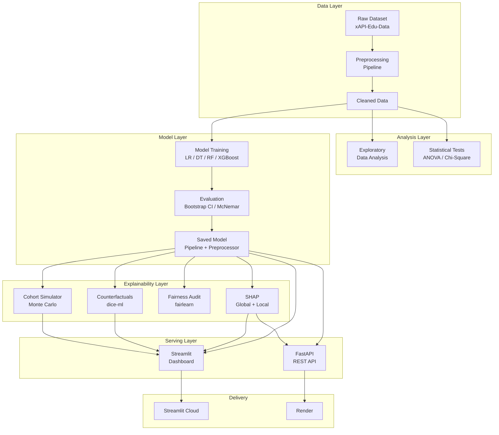

# Student Performance Prediction System

[](https://github.com/satyamshrivastav955-dotcom/student-performance-prediction-system/actions)
[](https://www.python.org/downloads/)
[](LICENSE)

> A production-quality ML system that predicts student academic performance (High / Medium / Low), explains why, and suggests what to change — built entirely with classical ML, no deep learning.

**Author:** Satyam (3rd Year, Computer Engineering)  
**Project:** SkillOrbit ML Capstone

---

## 🎯 What This Does

| Feature | Description |
|---|---|
| **Performance Prediction** | Classifies students as High / Medium / Low using engagement metrics |
| **SHAP Explanations** | Shows *why* each prediction was made, per student |
| **Counterfactual Coaching** | "If your resource visits went from 12 to 41, you'd be predicted Medium" |
| **Fairness Audit** | Checks for bias across gender and nationality |
| **Cohort Simulator** | Monte Carlo simulation: "What if the whole class improved participation by 15%?" |
| **Interactive Dashboard** | Clean Streamlit UI for students and teachers |
| **REST API** | FastAPI endpoint with auto-generated docs |

## 🏗️ Architecture



## 📁 Project Structure

```
student-performance-prediction/
├── .github/workflows/ci.yml          # GitHub Actions CI
├── config/config.yaml                # Central configuration (no hardcoded values)
├── data/
│   ├── raw/xAPI-Edu-Data.csv         # Original dataset
│   └── processed/cleaned.csv         # Cleaned dataset
├── src/
│   ├── data/                         # Loading & preprocessing
│   ├── analysis/                     # EDA & statistical tests
│   ├── models/                       # Training, evaluation, prediction
│   ├── explainability/               # SHAP explanations
│   ├── counterfactuals/              # dice-ml counterfactual engine
│   ├── fairness/                     # Demographic parity & equalized odds
│   ├── simulation/                   # Monte Carlo cohort simulator
│   ├── recommendations/              # SHAP-driven personalised advice
│   └── reporting/                    # Auto-generated report & presentation
├── dashboard/
│   ├── app.py                        # Streamlit entry point
│   └── pages/                        # 4 dashboard pages
├── api/
│   ├── main.py                       # FastAPI entry point
│   ├── schemas.py                    # Pydantic request/response models
│   └── postman_collection.json       # API test collection
├── tests/                            # pytest suite
├── models/                           # Saved model artifacts
├── reports/
│   ├── figures/                      # Publication-quality EDA plots
│   └── artifacts/                    # JSON results from every stage
├── notebooks/                        # Jupyter notebooks
├── scripts/run_pipeline.py           # One command to run everything
└── requirements.txt
```

## 🚀 Quick Start

### 1. Clone & Install

```bash
git clone https://github.com/YOUR_USERNAME/student-performance-prediction.git
cd student-performance-prediction
pip install -r requirements.txt
```

### 2. Run the Full Pipeline

```bash
python scripts/run_pipeline.py
```

This runs everything in order: data cleaning → EDA → statistical tests → model training → SHAP → counterfactuals → fairness audit → cohort simulation → recommendations → report generation.

### 3. Launch the Dashboard

```bash
streamlit run dashboard/app.py
```

### 4. Start the API

```bash
uvicorn api.main:app --reload
```

Then visit `http://localhost:8000/docs` for the interactive API documentation.

### Run Individual Stages

```bash
python scripts/run_pipeline.py --only train           # Just training
python scripts/run_pipeline.py --from explain          # From SHAP onwards
python scripts/run_pipeline.py --skip simulation       # Skip simulation
python scripts/run_pipeline.py --list                  # See all stages
```

## 🧪 Testing

```bash
pytest tests/ -v --tb=short --cov=src
```

## 📊 Model Performance

| Model | Accuracy | Macro-F1 | Status |
|---|---|---|---|
| Logistic Regression | — | — | Baseline |
| Decision Tree | — | — | Compared |
| Random Forest | — | — | Compared |
| Gradient Boosting (XGBoost) | — | — | Compared |

> *Run the pipeline to fill in these numbers — they come from `reports/artifacts/metrics.json`.*

**Validation approach:**
- Stratified 5-fold cross-validation
- Hyperparameter tuning (RandomizedSearchCV) on the top 2 candidates
- Bootstrapped 95% confidence intervals on test metrics
- McNemar's test to statistically validate the model selection

## 🔑 Key Design Decisions

1. **No deep learning.** With 478 students, gradient-boosted trees outperform neural networks and stay interpretable. This is the correct engineering choice, not a compromise.

2. **Pipeline includes preprocessing.** The saved `model.joblib` contains both the `ColumnTransformer` and the classifier, so the dashboard and API feed in *raw* student data. No encoding mismatch bugs.

3. **Config-driven.** Every hyperparameter, path, and magic number lives in `config/config.yaml`. The source code contains zero hardcoded values.

4. **Statistical rigour over vibes.** We don't just say "Random Forest is best" — we prove it with bootstrapped CIs and McNemar's test.

## 📦 Tech Stack

| Category | Tools |
|---|---|
| Data | pandas, numpy, scipy |
| ML | scikit-learn, xgboost |
| Explainability | shap, dice-ml |
| Fairness | fairlearn |
| Visualisation | matplotlib, seaborn, plotly |
| Dashboard | streamlit |
| API | fastapi, pydantic, uvicorn |
| Testing | pytest, pytest-cov |
| CI | GitHub Actions |
| Deployment | Streamlit Cloud (dashboard), Render (API) |

## 📜 License

MIT

---

*Built by Satyam for the SkillOrbit ML Capstone.*
