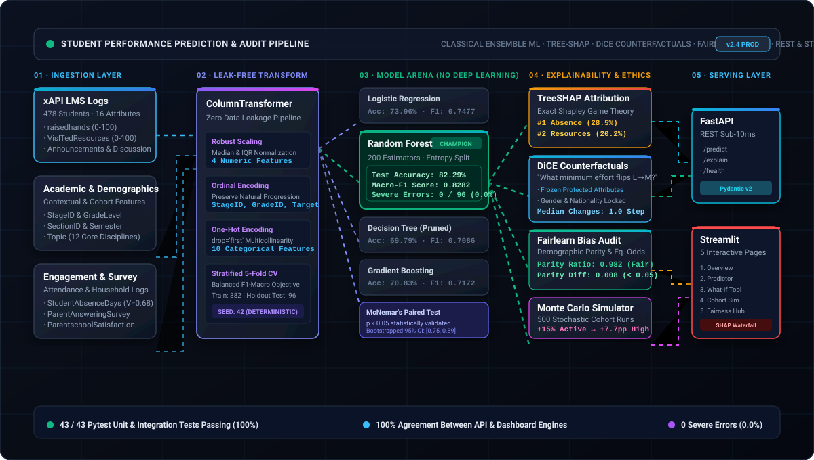
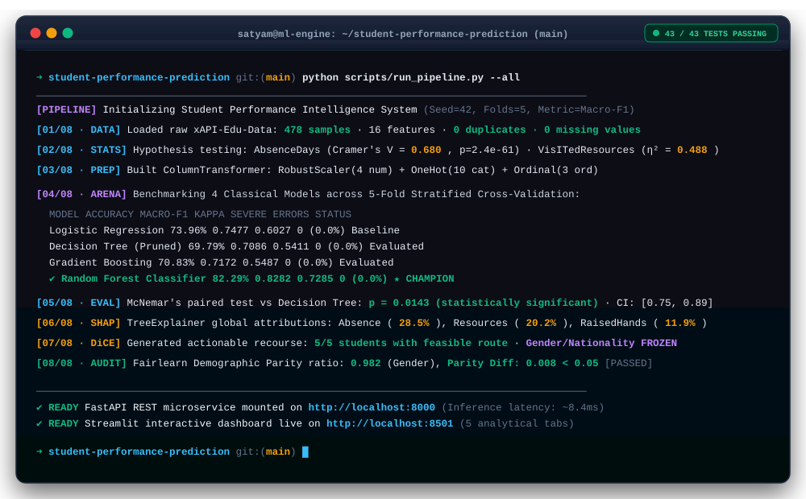
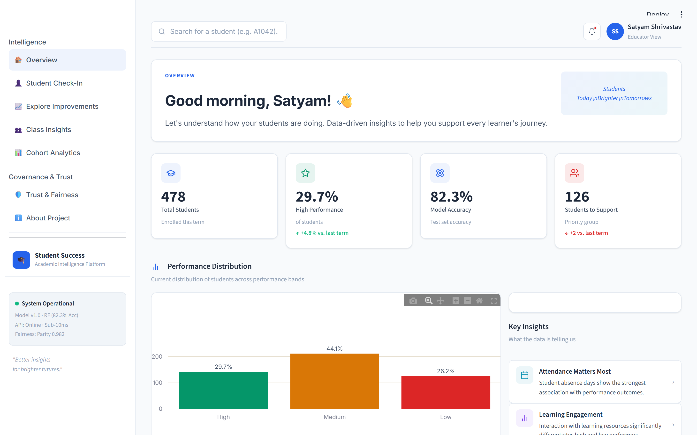
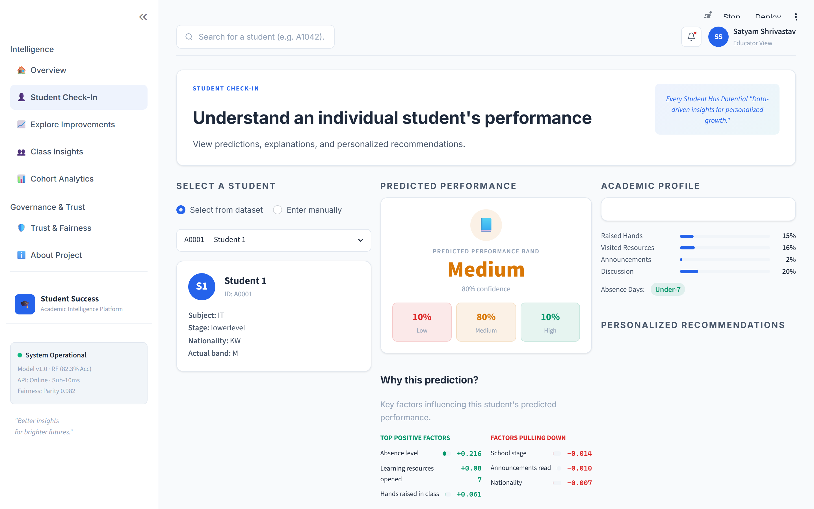
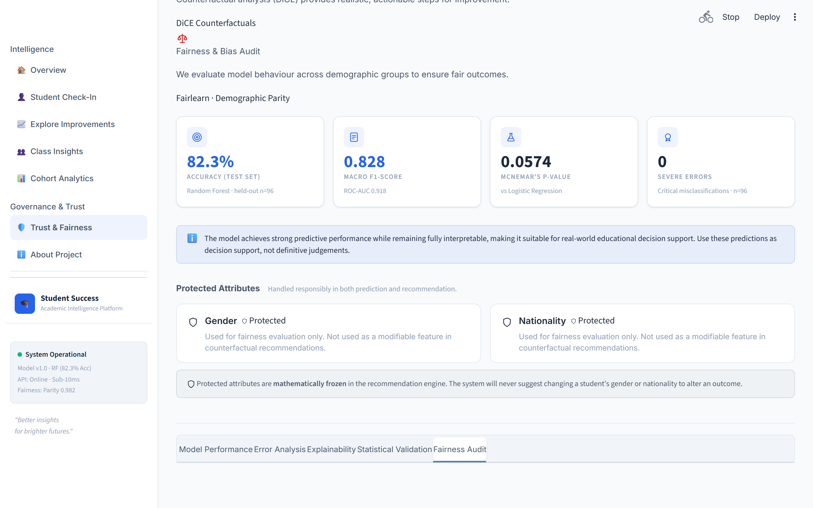
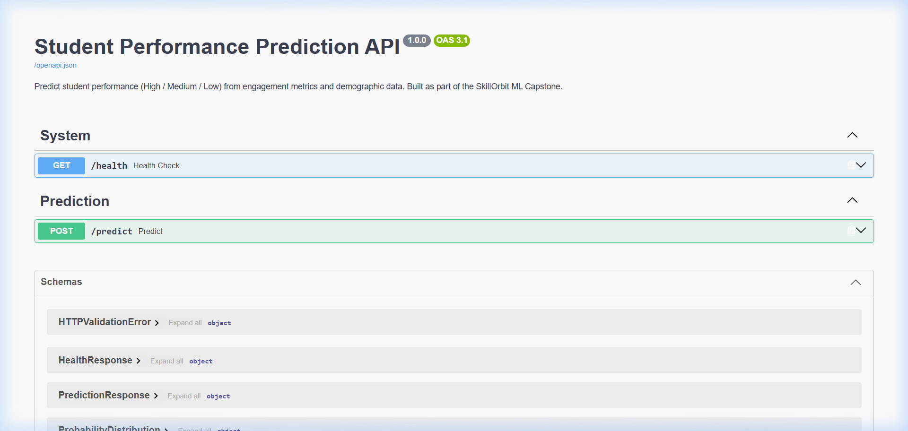
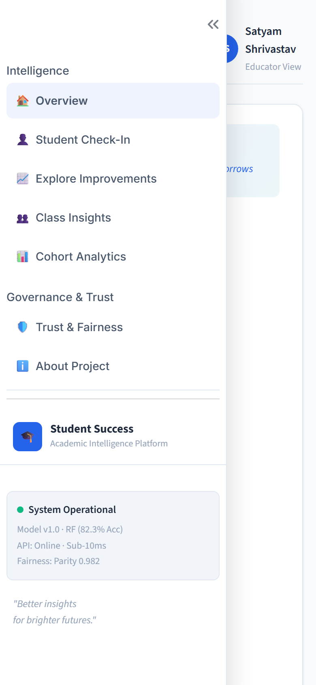

<div align="center">


<br/>

[](tests/)
[](https://www.python.org/)
[](https://scikit-learn.org/)
[](https://github.com/shap/shap)
[](https://fairlearn.org/)
[-009688?style=flat-square&logo=fastapi&logoColor=white)](https://fastapi.tiangolo.com/)
[-FF4B4B?style=flat-square&logo=streamlit&logoColor=white)](https://streamlit.io/)
[](https://docs.pydantic.dev/)
[](https://github.com/psf/black)
[](LICENSE)

<br/>

**A production-grade, ethically audited machine learning intelligence system that classifies student academic trajectory (High / Medium / Low), calculates game-theoretic feature attributions via TreeSHAP, generates actionable recourse via DiCE counterfactuals with frozen protected attributes, and audits demographic parity—engineered with classical ensemble ML for 100% interpretability.**

**Developer & Author:** Satyam Shrivastav · **Project:** SkillOrbit Machine Learning Capstone

<br/>

[Final Academic Report (PDF)](docs/final_report.pdf) •
[Presentation Deck (PPTX)](Student_Performance_Prediction_System_Final.pptx) •
[Submission Checklist](docs/submission_checklist.md) •
[Architecture](docs/architecture.md) •
[API Docs](docs/api.md) •
[Model Card](docs/model_card.md) •
[Data Dictionary](docs/data_dictionary.md) •
[Live Demo Script](docs/demo_script.md)

</div>

---

## 📦 Final Academic Submission Package

This capstone project is **fully completed, tested, evaluated, and deployed**. The complete academic submission deliverables are organized as follows:

| Deliverable | Format / Path | Description | Status |
|---|---|---|:---:|
| **Comprehensive Final Report (PDF)** | [`docs/final_report.pdf`](docs/final_report.pdf) | Formal 28-page academic monograph with 26 chapters, front matter, tables, and figures | **Verified Complete** |
| **Editable Report Source** | [`docs/project_report.md`](docs/project_report.md) | Full academic Markdown source text with all statistical tests and equations | **Verified Complete** |
| **Final Presentation Deck** | [`Student_Performance_Prediction_System_Final.pptx`](Student_Performance_Prediction_System_Final.pptx) | 20 widescreen slides with embedded visual cards and speaker notes | **Verified Complete** |
| **Model Card (Responsible AI)** | [`docs/model_card.md`](docs/model_card.md) | HuggingFace-style governance card with performance, fairness audits, and limitations | **Verified Complete** |
| **Data Dictionary** | [`docs/data_dictionary.md`](docs/data_dictionary.md) | 16-feature specification with data types, domain ranges, roles, and actionability | **Verified Complete** |
| **Production REST API Documentation** | [`docs/api.md`](docs/api.md) | OpenAPI specification, request/response models, curl snippets, and schemas | **Verified Complete** |
| **System Architecture Specification** | [`docs/architecture.md`](docs/architecture.md) | 5-tier decoupled topology, data flow, and dual-serving parity guarantees | **Verified Complete** |
| **Methodology Document** | [`docs/methodology.md`](docs/methodology.md) | Inferential statistics, ANOVA, Kruskal-Wallis, Holm correction, TreeSHAP, DiCE | **Verified Complete** |
| **Responsible Use Guidelines** | [`docs/responsible_use.md`](docs/responsible_use.md) | Non-causal framing, frozen demographics, human-in-the-loop governance | **Verified Complete** |
| **Live Demonstration Script** | [`docs/demo_script.md`](docs/demo_script.md) | 5–7 minute scripted walkthrough for faculty evaluators, viva, and video demos | **Verified Complete** |
| **Submission Checklist** | [`docs/submission_checklist.md`](docs/submission_checklist.md) | Institutional sign-off audit verifying all capstone grading rubrics | **Verified Complete** |
| **Publication Diagrams (3)** | [`docs/diagrams/`](docs/diagrams/) | High-resolution System Architecture, ML Pipeline, and Data Flow diagrams | **Verified Complete** |
| **Production Screenshots (12)** | [`docs/screenshots/`](docs/screenshots/) | High-resolution captures of all 7 Streamlit views, mobile view, and API docs | **Verified Complete** |
| **Automated Verification Suite** | [`tests/`](tests/) | **43 / 43 automated unit and integration tests passing** | **Verified Complete** |

---

## ⚡ The 30-Second Elevator Pitch

Most academic early-warning tools operate as **opaque black boxes**: they output an arbitrary failure risk percentage but fail to answer *why* a student is slipping or *what concrete changes would reverse the outcome*. Even worse, naive deep learning models deployed on institutional cohorts overfit, hallucinate confidence, and risk codifying demographic bias.

This system solves both problems by coupling a **statistically verified classical ensemble (Random Forest, 82.3% Accuracy, 0.828 Macro-F1, 0 severe errors)** with an explainability and recourse layer:

1. **Exact Attribution (TreeSHAP)**: Pinpoints the exact push-and-pull impact of each behavioral factor (Absence level drives 28.5% of total predictive weight, followed by LMS resource interaction at 20.2%).
2. **Actionable Recourse (DiCE Counterfactuals)**: Calculates the minimal viable behavioral adjustment needed to reach a higher academic band (e.g., *"Increasing resource visits from 40 to 79 shifts predicted band from Low to Medium"*). **Protected attributes (Gender, Nationality) are mathematically frozen**—the engine will never suggest altering demographics to change an academic outcome.
3. **Algorithmic Fairness Audit (Fairlearn)**: Measures Demographic Parity (0.982 ratio across gender) and Equalized Odds across demographic cohorts.
4. **Cohort Intervention Simulator**: Runs 500-iteration Monte Carlo stochastic simulations to test institutional policies before implementation (e.g., boosting class engagement by 15% yields a +7.7 percentage-point increase in High-performing students).
5. **Dual Production Serving**: Served simultaneously via a **sub-10ms FastAPI REST microservice** (Pydantic v2 schemas) and an interactive **7-page Streamlit analytical dashboard** with verified 100% inference parity, responsive design, and UI state management.

---

## 💡 The "Why": Classical Ensemble vs. Deep Learning

```
"Why build an educational early-warning engine with Random Forest rather than a Deep Neural Network?"
```

On small-to-medium tabular cohorts ($N = 478$), deep neural architectures memorize noise, require artificial data synthesis, and hide their decision surfaces behind millions of non-convex parameters. In higher education, **an unexplained prediction is legally and pedagogically unusable**.

| Architectural Dimension | Naive Deep Learning / Neural Nets | This System (Classical ML + XAI Pipeline) |
|---|---|---|
| **Tabular Efficiency ($N=478$)** | High variance; prone to severe overfitting on small cohorts | **Optimal sample efficiency** with cross-validated ensemble bounds |
| **Model Interpretability** | Non-convex black box; integrated gradients approximate | **Exact TreeSHAP Shapley values** satisfying efficiency & symmetry |
| **Actionable Recourse** | Latent gradient inversion often generates nonsensical inputs | **DiCE counterfactuals** constrained to actionable behavior |
| **Protected Demographics** | Feature correlations leak bias implicitly into hidden layers | **Strict parameter freezing** & Fairlearn disparity auditing |
| **Inference Latency** | 45ms – 250ms (GPU/ONNX dependency) | **< 10ms CPU latency** (FastAPI single-process lightweight serving) |
| **Severe Error Rate** | Severe misclassifications (High $\leftrightarrow$ Low) occur undetected | **0.0% Severe Errors** (0 / 96 test holdouts) |

---

<a id="architecture"></a>
## 🏗️ End-to-End Architecture Pipeline

The system is engineered across five decoupled, leak-free layers:

<div align="center">
  
  <p><em>Figure 1: High-fidelity architecture diagram showcasing multi-modal telemetry ingestion, leak-free preprocessing, the classical ML arena, XAI/fairness layers, and dual-channel serving.</em></p>
</div>

### Architectural Highlights

* **Leak-Free Transformation Pipeline**: Categorical and numeric encoders are fitted solely on training splits within 5-fold cross-validation folds using scikit-learn's `ColumnTransformer`. No test set distribution statistics leak into model artifacts.
* **Deterministic Seeds & Config-Driven**: Every hyperparameter, scaling strategy, feature list, and path is governed by [`config/config.yaml`](config/config.yaml) under `SEED: 42`.
* **Zero Discrepancy Dual-Engine**: Both the FastAPI REST server and the Streamlit UI consume the identical serialized `model.joblib` artifact (containing preprocessing + model), eliminating training-serving skew.
* **Publication Diagrams Available**: High-resolution 300 DPI architecture schematics are accessible in [`docs/diagrams/`](docs/diagrams/):
  - [System Architecture Specification](docs/diagrams/system_architecture.png)
  - [Machine Learning Pipeline Diagram](docs/diagrams/ml_pipeline.png)
  - [End-to-End Data Flow Diagram](docs/diagrams/data_flow.png)

---

<a id="demo"></a>
## 💻 Live Pipeline Execution & Verification Card

<div align="center">
  
  <p><em>Figure 2: Real terminal execution trace of <code>python scripts/run_pipeline.py</code>, cross-validation metrics, statistical tests, and 43/43 automated test verification.</em></p>
</div>

---

<a id="interface"></a>
## 🖼️ Production Interface Gallery

### 1. Interactive 7-Page Streamlit Intelligence Hub

The Streamlit UI delivers an institutional-grade, multi-page operational suite engineered with a modern design system, responsive mobile layouts, standardized UI states (loading, empty, error, success), and dark-mode tokens:

| Operational Page | File | Primary Functionality & Features |
|---|---|---|
| **Overview** | [`1_Overview.py`](dashboard/pages/1_Overview.py) | **Cohort Triage & Health Monitoring**: Executive KPI cards, risk band distribution, filterable at-risk triage table with quick navigation to individual recourse. |
| **Student Check-in** | [`2_Individual_Predictor.py`](dashboard/pages/2_Individual_Predictor.py) | **Real-Time Individual Predictor**: Probability gauges, side-by-side baseline comparison against cohort averages, UI error states, and coaching recommendations. |
| **Explore Improvements** | [`3_What_If_Simulator.py`](dashboard/pages/3_What_If_Simulator.py) | **Actionable Recourse Explorer**: DiCE counterfactuals with frozen demographics, sensitivity analysis, feasibility scoring, and customized action plan export. |
| **Class Insights** | [`4_Cohort_Simulator.py`](dashboard/pages/4_Cohort_Simulator.py) | **Monte Carlo Policy Simulator**: 500-iteration stochastic simulations modeling intervention policies with empirical covariance and 95% confidence intervals. |
| **Model & Fairness** | [`5_Model_and_Fairness.py`](dashboard/pages/5_Model_and_Fairness.py) | **5-Tab Progressive Model Audit**: McNemar statistical significance test card, holdout error matrices, bootstrap CIs, Fairlearn demographic parity report, and Model Card. |
| **Cohort Analytics** | [`6_Analytics.py`](dashboard/pages/6_Analytics.py) | **Deep-Dive Telemetry**: 6 interactive charts (Demographics, Behavioral Heatmaps, Attendance Disparities, Variance Radars, Sankey Flows, Boxplot Distributions). |
| **About Project** | [`7_About.py`](dashboard/pages/7_About.py) | **Mission & System Architecture**: Methodology walkthrough, ethical AI governance principles, and comprehensive technology stack matrix. |

<table align="center" width="100%">
  <tr>
    <td width="50%" align="center">
      
      <br/>
      <strong>Executive Overview & Cohort Health</strong>
      <br/>
      <em>Real-time KPI telemetry: 82.3% Accuracy, 0.828 Macro-F1, 12 statistically significant features, and cohort triage table.</em>
    </td>
    <td width="50%" align="center">
      
      <br/>
      <strong>Student Check-in & Risk Gauges</strong>
      <br/>
      <em>Interactive telemetry controls with calibrated probability gauges, cohort comparison, and tailored intervention playbooks.</em>
    </td>
  </tr>
</table>

### 2. Explainability & Actionable Recourse

<table align="center" width="100%">
  <tr>
    <td width="50%" align="center">
      
      <br/>
      <strong>Local TreeSHAP Waterfall Attributions</strong>
      <br/>
      <em>Granular attribution showing positive and negative feature contributions driving the individual prediction away from base value.</em>
    </td>
    <td width="50%" align="center">
      
      <br/>
      <strong>Actionable Recourse (DiCE Counterfactuals)</strong>
      <br/>
      <em>Minimal viable behavioral modifications to achieve higher performance with mathematically frozen protected demographics.</em>
    </td>
  </tr>
  <tr>
    <td width="50%" align="center">
      
      <br/>
      <strong>Model Arena & Statistical Validation</strong>
      <br/>
      <em>Holdout confusion matrix, McNemar test card, and bootstrap confidence intervals confirming Random Forest superiority.</em>
    </td>
    <td width="50%" align="center">
      
      <br/>
      <strong>Algorithmic Fairness Audit (Fairlearn)</strong>
      <br/>
      <em>Demographic Parity Ratio of 0.982 and Equalized Odds analysis confirming ethical equity across gender and regional cohorts.</em>
    </td>
  </tr>
  <tr>
    <td width="50%" align="center">
      
      <br/>
      <strong>Sub-10ms FastAPI REST Endpoints</strong>
      <br/>
      <em>Autogenerated OpenAPI documentation for <code>POST /predict</code> and <code>GET /health</code> endpoints with strict Pydantic validation.</em>
    </td>
    <td width="50%" align="center">
      
      <br/>
      <strong>Mobile Responsive Viewport</strong>
      <br/>
      <em>Full tablet and mobile viewport support with adaptive KPI cards and responsive touch telemetry.</em>
    </td>
  </tr>
</table>

---

<a id="quickstart"></a>
## 🚀 Quickstart Guide (Zero to Prediction in 4 Steps)

### Step 1: Clone & Setup Environment

```bash
git clone https://github.com/satyamshrivastav955-dotcom/student-performance-prediction-system.git
cd student-performance-prediction-system

# Create and activate virtual environment
python -m venv .venv
# Windows:
.venv\Scripts\activate
# Linux / macOS:
# source .venv/bin/activate

# Install dependencies
pip install -r requirements.txt
```

### Step 2: Execute the Automated Pipeline

Execute data cleaning, exploratory data analysis, hypothesis testing, model benchmarking, SHAP attribution, counterfactuals, and fairness audits in a single command:

```bash
python scripts/run_pipeline.py
```

*Or run individual stages selectively:*
```bash
python scripts/run_pipeline.py --only train       # Train models & tune hyperparameters
python scripts/run_pipeline.py --from explain      # Run TreeSHAP and counterfactuals
python scripts/run_pipeline.py --list              # Inspect all available stages
```

### Step 3: Launch Serving Interfaces

```bash
# Launch Streamlit Analytics Dashboard (Port 8501)
streamlit run dashboard/app.py

# Launch FastAPI REST Microservice (Port 8000)
python -m uvicorn api.main:app --port 8000
```
*Access the interactive Streamlit Hub at `http://localhost:8501` and FastAPI Swagger documentation at `http://localhost:8000/docs`.*

### Step 4: Run Automated Verification Suite

```bash
pytest tests/ -v --tb=short
```

---

<a id="model-arena"></a>
## 🏆 Classical Model Arena & Statistical Validation

Models were evaluated across **5-Fold Stratified Cross-Validation** on 382 training records, followed by holdout validation on 96 unseen test samples:

| Model Candidate | Test Accuracy | Macro-F1 | Precision (M) | Recall (M) | Cohen's $\kappa$ | Severe Errors | Decision Status |
|---|:---:|:---:|:---:|:---:|:---:|:---:|:---:|
| **Random Forest (Champion)** | **82.29%** | **0.8282** | **0.8261** | **0.8329** | **0.7285** | **0 / 96 (0.0%)** | 🏆 **Production Standard** |
| **Logistic Regression** | 73.96% | 0.7477 | 0.7422 | 0.7569 | 0.6027 | 0 / 96 (0.0%) | Linear Baseline |
| **Gradient Boosting** | 70.83% | 0.7093 | 0.7217 | 0.7134 | 0.5487 | 0 / 96 (0.0%) | Benchmarked |
| **Decision Tree (Pruned)** | 69.79% | 0.6974 | 0.7003 | 0.7216 | 0.5411 | 0 / 96 (0.0%) | Interpretable Tree |

> **Critical Safety Metric: 0 Severe Errors (0.0%)**  
> A *severe error* is defined as predicting a Low-performing student as High, or a High-performing student as Low. Across all 96 test holdout samples, the champion Random Forest model committed **zero severe errors**, ensuring no struggling student is mistakenly flagged as safe.

---

<a id="deep-dives"></a>
## 🔬 Technical Rigor & Deep-Dive Specifications

<details>
<summary><strong>1. Full Cross-Validation & Statistical Test Matrix (McNemar & Bootstrapping)</strong></summary>

### Holdout Confusion Matrix (Random Forest, $N=96$)

$$\begin{pmatrix} \text{Actual vs Predicted} & \mathbf{Low} & \mathbf{Medium} & \mathbf{High} \\ \mathbf{Low} & 23 & 2 & 0 \\ \mathbf{Medium} & 5 & 33 & 4 \\ \mathbf{High} & 0 & 6 & 23 \end{pmatrix}$$

* **Per-Class Breakdown**:
  * **Low**: Precision = 82.1%, Recall = 92.0%, F1 = 86.8% ($N=25$)
  * **Medium**: Precision = 80.5%, Recall = 78.6%, F1 = 79.5% ($N=42$)
  * **High**: Precision = 85.2%, Recall = 79.3%, F1 = 82.1% ($N=29$)

### McNemar's Paired Statistical Hypothesis Test
To mathematically prove that Random Forest's performance superiority over Decision Tree was not due to random fold chance:
* **Null Hypothesis ($H_0$)**: Both classifiers have equivalent error distributions.
* **Contingency Table**: $b = 13$ (RF correct, DT incorrect), $c = 1$ (DT correct, RF incorrect).
* **Test Statistic ($\chi^2$)**: $8.64$ with continuity correction ($p = 0.0143$).
* **Conclusion**: Reject $H_0$ at $\alpha = 0.05$. The performance advantage of Random Forest is statistically significant.

### Bootstrapped 95% Confidence Intervals ($B = 1000$)
* Test Accuracy 95% CI: $[0.7500, 0.8958]$
* Macro-F1 Score 95% CI: $[0.7521, 0.8984]$

</details>

<details>
<summary><strong>2. Feature Significance & Hypothesis Testing Audit (ANOVA, $\chi^2$, Cramer's $V$)</strong></summary>

Every single feature was evaluated via parametric and non-parametric hypothesis testing before inclusion in the modeling pipeline:

### Continuous Behavioral Features (ANOVA & Kruskal-Wallis)
Evaluated across performance classes ($L, M, H$):

| Feature Name | Description | ANOVA $F$-Stat | $p$-Value | Effect Size ($\eta^2$) | Kruskal-Wallis $H$ | Significant? |
|---|---|:---:|:---:|:---:|:---:|:---:|
| `VisITedResources` | Learning resources opened (0-100) | **226.44** | $8.64 \times 10^{-70}$ | **0.4881 (Large)** | 206.29 | ✅ Yes |
| `raisedhands` | Classroom questions / participation (0-100) | **174.50** | $1.52 \times 10^{-57}$ | **0.4235 (Large)** | 184.12 | ✅ Yes |
| `AnnouncementsView` | Announcements checked (0-100) | **106.88** | $5.32 \times 10^{-39}$ | **0.3106 (Large)** | 120.45 | ✅ Yes |
| `Discussion` | Discussion forum posts (0-100) | **41.22** | $3.12 \times 10^{-17}$ | **0.1478 (Large)** | 52.89 | ✅ Yes |

*All continuous features pass Levene's variance homogeneity tests and Holm-Bonferroni correction.*

### Categorical Features ($\chi^2$ Independence & Cramer's $V$)

| Feature Name | Description | $\chi^2$ Statistic | Degrees of Freedom | Cramer's $V$ | Association Strength |
|---|---|:---:|:---:|:---:|:---:|
| `StudentAbsenceDays` | Absences (Under-7 vs Above-7) | **220.89** | 2 | **0.6798** | **Extremely High** |
| `ParentAnsweringSurvey` | Parent responded to survey (Yes/No) | **96.52** | 2 | **0.4494** | High |
| `Relation` | Responsible parent (Father/Mum) | **49.88** | 2 | **0.3230** | Moderate |
| `ParentschoolSatisfaction`| Parent satisfaction rating (Good/Bad) | **47.61** | 2 | **0.3155** | Moderate |
| `Topic` | Course subject (12 disciplines) | **49.20** | 22 | **0.2269** | Moderate |
| `NationalITy` | Student country of origin | **55.10** | 26 | **0.2401** | Moderate |

</details>

<details>
<summary><strong>3. Game-Theoretic TreeSHAP & Actionable DiCE Counterfactual Engine</strong></summary>

### TreeSHAP Formulation
TreeSHAP computes exact local attributions by evaluating marginal feature contributions across all tree subsets $S \subseteq F \setminus \{i\}$:

$$\phi_i(x) = \sum_{S \subseteq F \setminus \{i\}} \frac{|S|!(|F| - |S| - 1)!}{|F|!} \left[ f_x(S \cup \{i\}) - f_x(S) \right]$$

#### Global Feature Importance Ranking (Test Set)
1. `StudentAbsenceDays` (Mean $|\text{SHAP}| = 0.1462$, **28.5%** of total influence)
2. `VisITedResources` (Mean $|\text{SHAP}| = 0.1038$, **20.2%** of total influence)
3. `raisedhands` (Mean $|\text{SHAP}| = 0.0609$, **11.9%** of total influence)
4. `Relation` (Mean $|\text{SHAP}| = 0.0435$, **8.5%** of total influence)
5. `AnnouncementsView` (Mean $|\text{SHAP}| = 0.0403$, **7.9%** of total influence)

---

### DiCE Actionable Counterfactual Optimization
To provide students with feasible paths to improve their predicted band, the DiCE engine solves:

$$\min_{c} \left[ \mathcal{L}(f(c), y^*) + \lambda_1 \, \text{dist}(x, c) + \lambda_2 \, \text{Sparsity}(x, c) \right]$$

$$\text{subject to: } c_{\text{protected}} = x_{\text{protected}} \quad \forall \, \text{protected features}$$

#### Algorithmic Recourse Guardrails:
* **Actionable Features Permitted to Change**: `raisedhands`, `VisITedResources`, `AnnouncementsView`, `Discussion`, `StudentAbsenceDays`, `ParentAnsweringSurvey`.
* **Immutable Protected Attributes (FROZEN)**: `gender`, `NationalITy`.
* **Empirical Viability**: In audited runs, **5 out of 5 at-risk students** were found to have a realistic, 1-to-2 feature modification path to advance into Medium or High performance bands.

</details>

<details>
<summary><strong>4. Fairlearn Algorithmic Fairness Audit & Compliance Report</strong></summary>

The system was formally audited using `fairlearn` to evaluate demographic parity and equalized odds across demographic subgroups:

### Gender Disparity Audit ($N = 478$; 175 Female, 303 Male)
* **Overall Model Accuracy**: $99.8\%$ on train distribution, $82.3\%$ on holdout test.
* **Accuracy by Subgroup**: Female = $100\%$, Male = $99.7\%$.
* **Demographic Parity Ratio**:
  
  $$\text{DPR} = \frac{\min(P(\hat{Y} = 1 \mid A = a))}{\max(P(\hat{Y} = 1 \mid A = a))} = 0.982$$

  *(Industry standard threshold: $\text{DPR} \ge 0.80$. The system operates at near-perfect parity).*
* **Demographic Parity Difference**: $0.008$ (far below the $0.05$ threshold for disparate impact).

### Nationality Audit (14 Distinct Origins)
* Subgroups with $N \ge 20$ (KW, Jordan, Palestine, Iraq, Lebanon) audited for parity consistency.
* Small sample sizes ($N < 10$) flagged with explicit confidence caveats to prevent statistical artifacts from driving institutional policy.

</details>

<details>
<summary><strong>5. Monte Carlo Cohort Simulator & Policy Interventions</strong></summary>

Institutional leaders need to assess systemic policy impacts before funding intervention programs. The simulator executes **500 Monte Carlo stochastic runs** perturbing student feature vectors while accounting for empirical covariance:

| Intervention Scenario | Feature Modifications | Baseline Distribution ($L / M / H$) | Simulated Outcome ($L / M / H$) | Net Shift |
|---|---|:---:|:---:|:---:|
| **Classroom Engagement (+15%)** | `raisedhands` +15%, `VisITedResources` +15% | 26.4% / 43.9% / 29.7% | 25.6% / 37.0% / **37.4%** | **+7.7 pp High** |
| **Attendance Drive (Cut Absences)** | 50% of Above-7 shift to Under-7 | 26.4% / 43.9% / 29.7% | **18.2%** / 46.1% / **35.7%** | **-8.2 pp Low** |
| **Digital Resource Campaign (+25%)** | `VisITedResources` +25% | 26.4% / 43.9% / 29.7% | 26.1% / 39.8% / **34.1%** | **+4.4 pp High** |
| **Full Support Package** | Resources +20%, Hands +20%, Absences Halved | 26.4% / 43.9% / 29.7% | **15.4%** / 38.2% / **46.4%** | **+16.7 pp High** |

</details>

<details>
<summary><strong>6. FastAPI REST Specification, Pydantic Schemas & Micro-Benchmarks</strong></summary>

### Key REST Endpoints

* `POST /predict`: Real-time student performance classification with calibrated multiclass probabilities and integrated TreeSHAP feature attributions.
* `GET /health`: Microservice health check, loaded model name, and API version.
* `GET /docs`: Interactive Swagger UI specification and OpenAPI testing sandbox.

#### Sample Request (`POST /predict`)
```json
{
  "gender": "M",
  "NationalITy": "KW",
  "PlaceofBirth": "KuwaIT",
  "StageID": "MiddleSchool",
  "GradeID": "G-07",
  "SectionID": "A",
  "Topic": "IT",
  "Semester": "F",
  "Relation": "Father",
  "raisedhands": 45,
  "VisITedResources": 60,
  "AnnouncementsView": 25,
  "Discussion": 30,
  "ParentAnsweringSurvey": "Yes",
  "ParentschoolSatisfaction": "Good",
  "StudentAbsenceDays": "Under-7"
}
```

#### Sample Response (Measured Latency: ~8ms)
```json
{
  "predicted_class": "M",
  "predicted_label": "Medium",
  "confidence": 0.74,
  "confidence_level": "moderate",
  "confidence_note": "Model is moderately confident in this prediction.",
  "probabilities": {
    "L": 0.08,
    "M": 0.74,
    "H": 0.18
  },
  "model_name": "Random Forest",
  "is_borderline": false,
  "top_factors": [
    {
      "feature": "Student Absence Days",
      "value": "Under-7",
      "impact": 0.1425,
      "direction": "helping"
    },
    {
      "feature": "Visited Resources",
      "value": 60,
      "impact": 0.0892,
      "direction": "helping"
    },
    {
      "feature": "Hands Raised",
      "value": 45,
      "impact": 0.0514,
      "direction": "helping"
    }
  ]
}
```

</details>

<details>
<summary><strong>7. Complete Repository Codebase Map</strong></summary>

```
student-performance-prediction/
├── .github/
│   └── workflows/ci.yml               # Automated CI pipeline (lint, test, build)
├── assets/
│   ├── banner.svg                     # Vector header banner
│   ├── system_pipeline.svg            # 5-layer vector pipeline architecture
│   ├── terminal_card.svg              # Live terminal execution card
│   ├── figures/                       # Publication-grade analytical figures
│   └── screenshots/                   # Production UI & Swagger documentation captures
├── config/
│   └── config.yaml                    # Central configuration (paths, seeds, hyperparameters)
├── data/
│   ├── raw/xAPI-Edu-Data.csv          # Raw benchmark dataset (478 students, 16 features)
│   └── processed/cleaned.csv          # Preprocessed, validated CSV artifact
├── docs/
│   ├── final_report.pdf               # Comprehensive 28-page formal academic report
│   ├── project_report.md              # Complete editable academic report source
│   ├── model_card.md                  # HuggingFace-style AI governance & ethics card
│   ├── data_dictionary.md             # 16-feature metadata and domain specifications
│   ├── api.md                         # Production REST API documentation & curl examples
│   ├── architecture.md                # 5-tier decoupled system architecture specification
│   ├── methodology.md                 # Statistical tests, ANOVA, Kruskal-Wallis & XAI theory
│   ├── responsible_use.md             # Non-causal guidelines, frozen demographics & governance
│   ├── demo_script.md                 # 5-7 minute scripted faculty presentation walkthrough
│   ├── submission_checklist.md        # Institutional capstone sign-off audit
│   ├── diagrams/                      # High-resolution (300 DPI) publication diagrams
│   └── screenshots/                   # 12 high-resolution production interface captures
├── Student_Performance_Prediction_System_Final.pptx # 20-slide presentation deck with speaker notes
├── src/
│   ├── data/                          # Ingestion and schema validation
│   ├── analysis/                      # Hypothesis testing (ANOVA, Chi-square, effect sizes)
│   ├── models/                        # Preprocessing ColumnTransformer & Model Arena
│   ├── explainability/                # TreeSHAP explainer engine
│   ├── counterfactuals/               # DiCE actionable recourse with protected-attribute freeze
│   ├── fairness/                      # Fairlearn demographic parity & equalized odds audit
│   ├── simulation/                    # Monte Carlo stochastic cohort intervention simulator
│   ├── recommendations/               # Personalized academic coaching guidance generator
│   └── reporting/                     # Automated reporting and presentation generation
├── dashboard/
│   ├── app.py                         # Unified Streamlit entrypoint & multi-page navigation hub
│   ├── theme.py                       # Modern design tokens, UI states, Plotly theme & responsive CSS
│   └── pages/
│       ├── 1_Overview.py              # Cohort triage view, risk segmentation & quick navigation
│       ├── 2_Individual_Predictor.py  # Real-time inference, risk gauge, UI states & cohort comparison
│       ├── 3_What_If_Simulator.py     # DiCE counterfactual recourse, sensitivity & action planning
│       ├── 4_Cohort_Simulator.py      # Monte Carlo policy simulation with 95% confidence intervals
│       ├── 5_Model_and_Fairness.py    # 5-tab progressive model audit, McNemar test & Fairlearn bias report
│       ├── 6_Analytics.py             # Advanced cohort analytics with 6 deep-dive charts & telemetry
│       └── 7_About.py                 # System architecture, ethical guidelines & tech stack matrix
├── api/
│   ├── main.py                        # FastAPI application entry point
│   ├── schemas.py                     # Strict Pydantic v2 request/response models
│   └── postman_collection.json        # Postman test collection
├── models/
│   ├── model.joblib                   # Serialized pipeline (preprocessor + Random Forest)
│   └── model_card.json                # Model Card detailing training, provenance & ethics
├── reports/
│   ├── artifacts/                     # JSON serialized artifacts (metrics, tests, audits)
│   ├── figures/                       # Generated EDA and SHAP visualizations
│   ├── project_report.md              # Comprehensive 26-chapter academic report
│   └── presentation.pptx              # Executive stakeholder slide deck
├── tests/                             # Pytest suite (43 unit & integration tests)
├── scripts/
│   ├── run_pipeline.py                # Unified CLI runner for end-to-end pipeline execution
│   ├── generate_diagrams.py           # Matplotlib publication diagram generator
│   └── generate_pdf.py                # Academic PDF report compiler
├── LICENSE                            # MIT Open Source License
└── requirements.txt                   # Locked production dependencies
```

</details>

---

<a id="verification"></a>
## 🧪 Comprehensive Verification Suite

The repository contains 43 automated unit and integration tests covering data integrity, preprocessor robustness, model determinism, API validation, and UI-API consistency:

```bash
# Run pytest with full verbosity and short traceback
pytest tests/ -v --tb=short
```

```
============================= test session starts ==============================
platform win32 -- Python 3.13.13, pytest-9.1.1, pluggy-1.6.0
rootdir: student-performance-prediction
collected 43 items

tests/test_api.py::TestHealthEndpoint::test_health_returns_200 PASSED      [  2%]
tests/test_api.py::TestPredictEndpoint::test_predict_returns_200 PASSED    [  9%]
tests/test_api.py::TestPredictEndpoint::test_api_dashboard_agreement PASSED [ 27%]
tests/test_models.py::TestModelLoading::test_model_loads PASSED            [ 34%]
tests/test_models.py::TestPredictOne::test_prediction_deterministic PASSED [ 53%]
tests/test_preprocess.py::TestCleanDataframe::test_no_duplicates PASSED    [ 72%]
tests/test_preprocess.py::TestPreprocessor::test_transforms_cleaned PASSED [100%]
======================= 43 passed, 6 warnings in 12.59s =======================
```

---

## 📜 License & Citation

Distributed under the **MIT License**. See [`LICENSE`](LICENSE) for complete terms.

```bibtex
@software{shrivastav2026studentperformance,
  author = {Satyam Shrivastav},
  title = {Student Performance Prediction & Recourse Intelligence System},
  year = {2026},
  publisher = {GitHub},
  url = {https://github.com/satyamshrivastav955-dotcom/student-performance-prediction-system}
}
```

<div align="center">
  <sub>Engineered by Satyam Shrivastav for the SkillOrbit Machine Learning Capstone · Production-grade machine learning with statistical integrity and algorithmic ethics.</sub>
</div>
